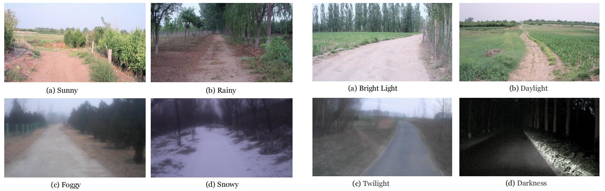

# Advancing Off-Road Autonomous Driving: The Large-Scale ORAD-3D Dataset and Comprehensive Benchmarks

Repository for our paper ["Advancing Off-Road Autonomous Driving: The Large-Scale ORAD-3D Dataset and Comprehensive Benchmarks"](https://arxiv.org/abs/2510.16500).

## Introduction
A major bottleneck in off-road autonomous driving research lies in the scarcity of large-scale, high-quality datasets and benchmarks. To bridge this gap, we present ORAD-3D, which, to the best of our knowledge, is the largest dataset specifically curated for off-road autonomous driving. ORAD-3D covers a wide spectrum of terrains, including woodlands, farmlands, grasslands, riversides, gravel roads, cement roads, and rural areas, while capturing diverse environmental variations across weather conditions (sunny, rainy, foggy, and snowy) and illumination levels (bright daylight, daytime, twilight, and nighttime). Building upon this dataset, we establish a comprehensive suite of benchmark evaluations spanning five fundamental tasks: 2D free-space detection, 3D occupancy prediction, rough GPS-guided path planning, vision-language model-driven autonomous driving, and world model for off-road environments. Together, the dataset and benchmarks provide a unified and robust resource for advancing perception and planning in challenging off-road scenarios.

<p align="center">
ORAD-3D Dataset
</p>

<p align="center">
ORAD-3D Dataset
</p>

<p align="center">
ORAD-3D Dataset
</p>

## Prepare data

The proposed off-road autonomous driving dataset ORAD-3D can be found [BaiduYun](XX) (code:XXXX, about 350GB). Extract and organize as follows:

```
|-- datasets
 |  |-- ORAD-3D
 |  |  |-- training
 |  |  |  |-- XX sequence   |-- calib
 |  |  |                    |-- sparse_depth
 |  |  |                    |-- dense_depth
 |  |  |                    |-- lidar_data
 |  |  |                    |-- local_path
 |  |  |                    |-- image_data
 |  |  |                    |-- occupancy
 |  |  |                    |-- gt_image
 |  |  |                    |-- gt_image_multi_seg
 |  |  |                    |-- scene_data (VLM)
 |  |  |                    |-- poses.txt
 ......
 |  |  |-- validation
 ......
 |  |  |-- testing
 ......
```

## 2D Free-Space Detection

Unlike the ORFD dataset, which adopts a binary road/non-road labeling scheme, our annotation protocol captures the complexity of off-road environments by including fine-grained classes such as safe road, boundary transition zones, puddles, rocks, vehicles, and pedestrians. This detailed semantic representation enables more nuanced terrain understanding and supports safer autonomous navigation.

<p align="center">
2D Free-Space Detection
</p>

## 3D Occupancy Prediction

Relying solely on 2D off-road free-space detection results is insufficient for accurately modeling complex 3D terrains. To address this limitation, we further construct 3D occupancy annotations for off-road environments. Specifically, we first apply the LiDAR odometry method KISS-ICP to register the collected LiDAR point clouds and obtain precise pose estimates. Multiple frames are then accumulated to generate dense point clouds, from which the 3D occupancy labels are subsequently derived.

<p align="center">
3D Occupancy Prediction
</p>

## Rough GPS-guided Path Planning

In off-road environments, GPS signals are often unreliable, preventing autonomous vehicles from obtaining accurate localization. To address this, we construct a rough GPS-guided path planning benchmark dataset. Specifically, we use the previously estimated poses as ground-truth driving trajectories and apply B-spline interpolation to generate waypoints. We then introduce controlled perturbations to these trajectories to simulate the effects of inaccurate GPS localization.

<p align="center">
Rough GPS-guided Path Planning
</p>

<p align="center">
Rough GPS-guided Path Planning
</p>

## VLM-based Autonomous Driving

Recent advances in VLMs have demonstrated their ability to analyze complex scenes through chain-of-thought reasoning, enabling end-to-end autonomous driving. However, research on applying VLMs to off-road autonomous driving remains limited. In this work, we first leverage the multimodal large model Qwen2.5-VL to annotate images from the ORAD-3D dataset, generating detailed scene descriptions as illustrated. Subsequently, using pose data as ground-truth trajectories, we prompt the VLM to predict future paths, enabling end-to-end path planning in off-road scenarios.

## Off-road World Model

In contrast to the abundance of large-scale datasets readily available for urban autonomous driving, research on off-road autonomous driving remains significantly constrained by the scarcity of suitable data. This paper seeks to address this critical limitation by investigating off-road scene data generation through the development of a world model capable of producing diverse and controllable off-road scenarios. Specifically, the proposed approach enables the synthesis of off-road data under extreme weather and illumination conditions, from multiple viewpoints, and across heterogeneous road environments, thereby substantially enhancing both the scale and diversity of off-road datasets.

##  License

Our codes and dataset are released under the Apache 2.0 license.

# Bibtex
If this work is helpful for your research, please consider citing the following BibTeX entry.

```
@article{ORAD-3D,
  title={Advancing Off-Road Autonomous Driving: The Large-Scale ORAD-3D Dataset and Comprehensive Benchmarks},
  author={Chen Min, Jilin Mei, Heng Zhai, Shuai Wang, Tong Sun, Fanjie Kong, Haoyang Li, Fangyuan Mao, Fuyang Liu, Shuo Wang, Yiming Nie, Qi Zhu, Liang Xiao, Dawei Zhao, Yu Hu},
  journal={Arxiv},
  year={2025}
}
```

# Acknowledgement

Many thanks to these excellent open source projects:

- [ORFD](https://github.com/chaytonmin/Off-Road-Freespace-Detection) 

- [Off-Road Survey](https://github.com/chaytonmin/Survey-Autonomous-Driving-in-Unstructured-Off-Road-Environments) 

- [KISS-ICP](https://github.com/PRBonn/kiss-icp)

- [Qwen3-VL](https://github.com/QwenLM/Qwen3-VL)
